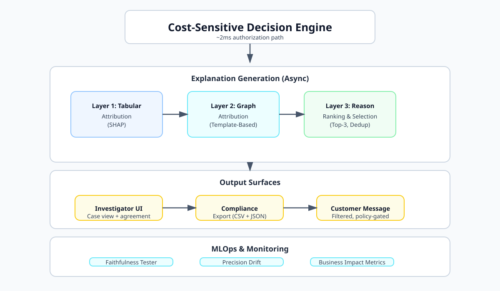
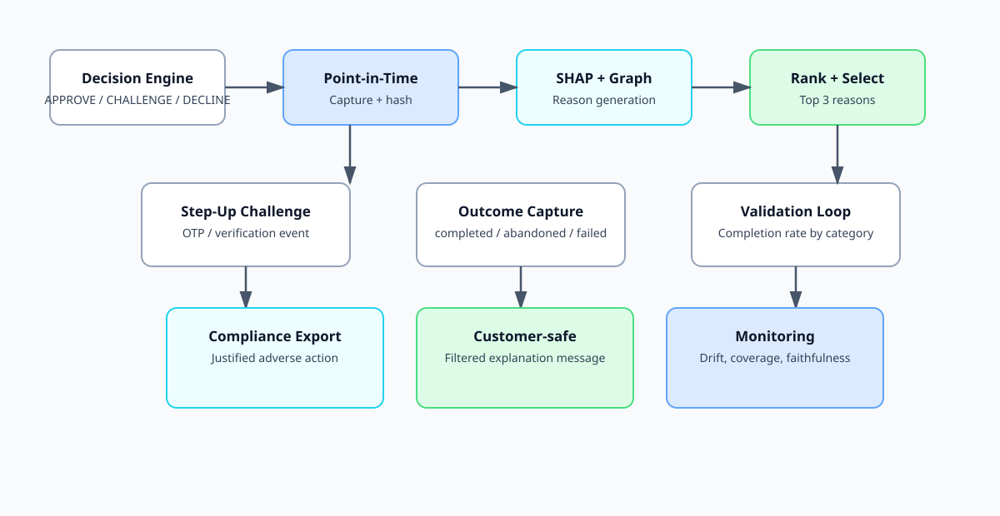
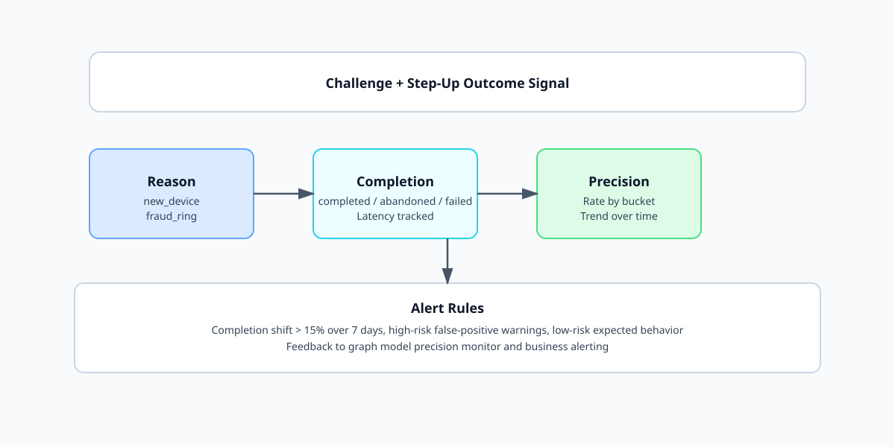
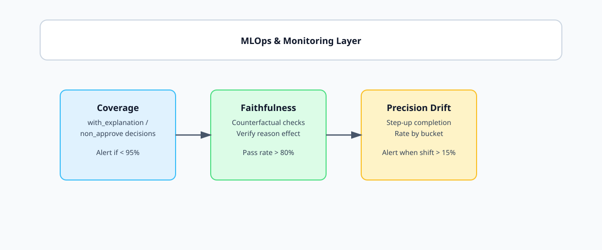

# Explainable Step-Up Decisioning System

A production-grade system that translates fraud model decisions into actionable, auditable, and defensible reason codes, while using step-up (OTP) outcomes as a real-world validation signal for model precision.

---

## Table of Contents

- [Overview](#overview)
- [System Architecture](#system-architecture)
- [Core Components](#core-components)
- [Data Flow](#data-flow)
- [Installation](#installation)
- [Configuration](#configuration)
- [API Reference](#api-reference)
- [Validation Loop](#validation-loop)
- [MLOps & Monitoring](#mlops--monitoring)
- [Deployment](#deployment)
- [Testing](#testing)
- [Business Impact](#business-impact)
- [Security & Compliance](#security--compliance)
- [Troubleshooting](#troubleshooting)

---

## Overview

### Problem Statement

The cost-sensitive decision engine produces APPROVE/CHALLENGE/DECLINE decisions, but numeric scores and thresholds are not reasons. This creates three distinct problems:

| Audience | Need | Consequence of No Explanation |
|----------|------|-------------------------------|
| Fraud Investigator | Fast, actionable summary | Rubber-stamping or ignoring model |
| Compliance/Regulator | Defensible written justification | Regulatory exposure |
| Declined Customer | Specific, corrective information | Support tickets, disputes, trust erosion |

### Solution

This system sits on top of the existing decision engine and:

1. Translates model outputs into a small set (≤3) of human-readable reason codes
2. Uses the OTP step-up channel as a fast behavioral ground-truth signal
3. Validates whether the graph model's confidence is actually earned
4. Provides compliance-ready adverse action justifications
5. Delivers customer-safe explanations where policy allows

### Key Differentiators

- **Async-first**: Zero latency impact on authorization hot path (~2ms unchanged)
- **Versioned templates**: Reason phrasing configurable by risk/compliance without code deploy
- **Point-in-time discipline**: Explanations reflect feature/graph state at decision time
- **Faithfulness verification**: Periodic counterfactual testing ensures stated reasons match actual model behavior
- **Precision monitoring**: Step-up completion rates provide fast-maturing validation for graph model

---

## System Architecture



```text
┌─────────────────────────────────────────────────────────────────────────────┐
│                     Cost-Sensitive Decision Engine                         │
│                         (~2ms authorization path)                          │
└─────────────────────────────────────────────────────────────────────────────┘
                                      │
                                      ▼
┌─────────────────────────────────────────────────────────────────────────────┐
│                    EXPLANATION GENERATION (Async)                          │
│                                                                             │
│  ┌───────────────────┐  ┌───────────────────┐  ┌─────────────────────────┐ │
│  │  Layer 1: Tabular  │  │  Layer 2: Graph   │  │  Layer 3: Reason       │ │
│  │  Attribution      │  │  Attribution      │  │  Ranking & Selection   │ │
│  │  (SHAP)           │  │  (Template-Based) │  │  (Top-3, Dedup)        │ │
│  └───────────────────┘  └───────────────────┘  └─────────────────────────┘ │
│                                                                             │
│  ┌───────────────────┐  ┌───────────────────┐  ┌─────────────────────────┐ │
│  │  Layer 4: Step-Up │  │  Layer 5:         │  │  Layer 6: Point-in-Time │ │
│  │  Capture          │  │  Validation Loop  │  │  State Capture          │ │
│  └───────────────────┘  └───────────────────┘  └─────────────────────────┘ │
└─────────────────────────────────────────────────────────────────────────────┘
                                      │
                                      ▼
┌─────────────────────────────────────────────────────────────────────────────┐
│                          OUTPUT SURFACES                                   │
│                                                                             │
│  ┌───────────────────┐  ┌───────────────────┐  ┌─────────────────────────┐ │
│  │  Investigator UI  │  │  Compliance       │  │  Customer Message       │ │
│  │  (Case View +     │  │  Export           │  │  (Filtered, Policy-     │ │
│  │   Agreement)      │  │  (CSV + JSON)     │  │   Gated)                │ │
│  └───────────────────┘  └───────────────────┘  └─────────────────────────┘ │
└─────────────────────────────────────────────────────────────────────────────┘
                                      │
                                      ▼
┌─────────────────────────────────────────────────────────────────────────────┐
│                    MLOps & Monitoring                                       │
│                                                                             │
│  ┌───────────────────┐  ┌───────────────────┐  ┌─────────────────────────┐ │
│  │  Faithfulness     │  │  Precision Drift  │  │  Business Impact        │ │
│  │  Tester           │  │  Detection        │  │  Metrics                │ │
│  └───────────────────┘  └───────────────────┘  └─────────────────────────┘ │
└─────────────────────────────────────────────────────────────────────────────┘
```

---

## Core Components

### 1. Tabular Attribution (Layer 1)

**File**: `src/attribution/shap_wrapper.py`

Uses SHAP TreeExplainer to generate per-feature contributions for tree-based tabular models.

**Key Design Decisions**:
- TreeExplainer (not KernelExplainer) for performance
- Precomputed background distribution refreshed with model retraining
- Raw SHAP values are intermediate representation, not final output

**Output**: List of `{"feature": str, "value": float, "shap_value": float, "severity_weight": float}`

### 2. Graph Attribution (Layer 2)

**File**: `src/attribution/graph_matcher.py`

Template-and-threshold mapping for structural graph signals.

**Key Design Decisions**:
- Versioned YAML config (not inline code)
- Auditable phrasing consistency
- Risk/compliance reviewable without code deploy

**Configuration Example**:
```yaml
version: "2026-08-30-v1"
templates:
  - signal: device_account_count
    threshold: 5
    phrase: "Device linked to {count} other accounts"
    severity_weight: 0.7
  - signal: shortest_path_to_confirmed_fraud
    threshold: 2
    phrase: "Account is {distance} hops from confirmed fraud device"
    severity_weight: 0.9
```

### 3. Reason Ranking (Layer 3)

**File**: `src/ranking/ranker.py`

Combines tabular and graph reasons, deduplicates, and selects top-3 by severity weight.

**Key Design Decisions**:
- Top-3 constraint based on cognitive load research
- Deduplication by feature/signal name
- Override-driven decisions labeled distinctly

### 4. Step-Up Capture (Layer 4)

**File**: `src/validation/step_up_schema.py`

Captures OTP completion/abandonment/failure outcomes and links to decisions.

**Schema**:
```json
{
  "transaction_id": "tx_88213",
  "step_up_channel": "otp_sms",
  "step_up_result": "completed",
  "step_up_latency_ms": 41200
}
```

### 5. Validation Loop (Layer 5)

**File**: `src/validation/metrics.py`

Computes `step_up_completion_rate` segmented by reason category and score bucket.

**Key Insight**: Completion rate for graph-driven challenges is a fast-maturing precision signal that arrives minutes (not months) after the decision.

**Output**:
```json
{
  "new_device": {"completion_rate": 0.65, "total": 120},
  "fraud_ring": {"completion_rate": 0.12, "total": 45},
  "network": {"completion_rate": 0.52, "total": 78}
}
```

### 6. Point-in-Time Capture

**File**: `src/data/point_in_time.py`

Captures and freezes feature/graph state at decision time with cryptographic integrity verification.

**Key Design Decisions**:
- SHA-256 hash for tamper detection
- Prevents "why did we challenge this" from drifting to "why would we challenge this today"

### 7. Faithfulness Testing

**File**: `src/validation/faithfulness.py`

Performs counterfactual perturbation tests to verify that stated reasons actually affect model predictions.

**Method**:
1. Identify feature associated with each stated reason
2. Perturb the feature by ±10%
3. Verify prediction changes meaningfully (>0.01)
4. Flag failed explanations as misleading

### 8. Graph Precision Monitor

**File**: `src/validation/graph_monitor.py`

Detects drift in graph model precision using step-up completion rates as a fast-maturing ground-truth signal.

**Alerts**:
- Completion rate change > 15% over 7-day window
- High completion rates in high-risk buckets (legitimate users being challenged)
- Low completion rates in low-risk buckets (potential false positives)

### 9. Business Metrics

**File**: `src/metrics/business_metrics.py`

Tracks business impact:
- Investigator time saved (est. 2 min/case with reasons)
- Regulatory risk reduction (adverse actions with justifications)
- Infrastructure cost (SHAP compute, storage, API)
- Quality metrics (investigator agreement, faithfulness pass rate)

---

## Data Flow



### Decision Processing Flow

```text
1. Decision Engine produces APPROVE/CHALLENGE/DECLINE
   ↓
2. If APPROVE: Store record with no explanation
   ↓
3. If non-APPROVE (async):
   a. Capture point-in-time state (features + hash)
   b. SHAP attribution on tabular features
   c. Graph template matching on structural features
   d. Rank, deduplicate, select top-3
   e. Attach to decision record
   ↓
4. If CHALLENGE: Trigger step-up (OTP)
   ↓
5. Step-up outcome captured via API
   ↓
6. Validation loop computes completion rates by category
   ↓
7. Graph precision monitor detects drift
   ↓
8. Business metrics aggregated for dashboard
```

### Async Guarantees

| Operation | Budget | Path |
|-----------|--------|------|
| Decision | ~2ms | Synchronous (unchanged) |
| Explanation Generation | Seconds | Asynchronous (queued) |
| Step-Up Capture | Seconds-Minutes | Async (OTP latency) |
| Validation Loop | Minutes-Hours | Background |
| Faithfulness Checks | Hours | Scheduled (24h) |

---

## Installation

### Prerequisites

- Python 3.10+
- Docker + Docker Compose (for production)
- 4GB+ RAM (SHAP computation)
- Access to tabular model artifact and background data

### Development Setup

```bash
# Clone and enter directory
git clone https://github.com/MfalmeML/explainable-stepup.git
cd explainable-stepup

# Create virtual environment
python -m venv venv
source venv/bin/activate  # Windows: venv\Scripts\activate

# Install dependencies
pip install -r requirements.txt

# Generate sample models
python scripts/generate_models.py

# Initialize test data
python init_data.py

# Run tests
python run_all_tests.py
```

### Production Setup

```bash
# Full deployment
chmod +x deploy.sh
./deploy.sh

# Or docker-compose
docker-compose -f docker-compose.prod.yml up -d
```

---

## Configuration

### Configuration File: `config/production_config.json`

```json
{
    "model_path": "/etc/explainable/models/tabular_model.pkl",
    "background_path": "/etc/explainable/models/background_data.pkl",
    "template_config_path": "/etc/explainable/config/templates/graph_reason_templates.yaml",
    "store_path": "/var/lib/explainable/outcome_store.json",
    "log_level": "INFO",
    "max_reasons": 3,
    "min_cases_for_validation": 5,
    "drift_threshold": 0.15,
    "step_up_channel": "otp_sms",
    "investigator_sample_size": 20
}
```

### Environment Variables

| Variable | Default | Description |
|----------|---------|-------------|
| `STORE_PATH` | `outcome_store.json` | Path to decision/outcome store |
| `MODEL_PATH` | `models/tabular_model.pkl` | Path to tabular model |
| `BACKGROUND_PATH` | `models/background_data.pkl` | SHAP background data |
| `TEMPLATE_CONFIG_PATH` | `config/templates/graph_reason_templates.yaml` | Graph template config |
| `LOG_LEVEL` | `INFO` | Logging level |
| `PORT` | `5000` | API port |

### Graph Template Configuration

Template config is versioned and managed as YAML:

```yaml
version: "2026-08-30-v6"  # Increment on change
templates:
  - signal: device_account_count
    threshold: 5           # Report only above this
    phrase: "Device linked to {count} other accounts"
    severity_weight: 0.7
  - signal: shortest_path_to_confirmed_fraud
    threshold: 2
    phrase: "Account is {distance} hops from confirmed fraud device"
    severity_weight: 0.9
```

**Versioning Rules**:
1. Increment version on any template change
2. Audit trace records which version produced each explanation
3. Rollback by pointer swap to previous version

---

## API Reference

All endpoints return JSON.

### Health Check

```http
GET /health
```

**Response**:
```json
{
  "status": "healthy",
  "timestamp": "2026-08-30T12:00:00Z",
  "service": "explainable-decisioning"
}
```

### Get Explanation

```http
GET /explanation/{transaction_id}
```

**Response**:
```json
{
  "transaction_id": "tx_88213",
  "decision": "CHALLENGE",
  "combined_risk_score": 0.63,
  "reasons": [
    {"text": "Transaction amount 8.2x normal", "source": "tabular", "weight": 0.31},
    {"text": "New device", "source": "tabular", "weight": 0.27},
    {"text": "Device linked to 4 other accounts", "source": "graph", "weight": 0.19}
  ],
  "override_driven": false,
  "reason_template_version": "2026-08-30-v6"
}
```

### Get Customer-Safe Message

```http
GET /explanation/{transaction_id}/customer
```

**Response**:
```json
{
  "transaction_id": "tx_88213",
  "message": "Your transaction was flagged due to: Transaction amount 8.2x normal, New device",
  "reasons": [
    {"text": "Transaction amount 8.2x normal", "source": "tabular", "weight": 0.31},
    {"text": "New device", "source": "tabular", "weight": 0.27}
  ],
  "customer_safe": true
}
```

### Record Investigator Agreement

```http
POST /reason-agreement
```

**Payload**:
```json
{
  "transaction_id": "tx_88213",
  "investigator_id": "inv_123",
  "agreement": true,
  "notes": "Reasons match my assessment"
}
```

**Response**:
```json
{"status": "recorded", "agreement": true}
```

### Record Step-Up Outcome

```http
POST /step-up-outcome
```

**Payload**:
```json
{
  "transaction_id": "tx_88213",
  "channel": "otp_sms",
  "result": "completed",
  "latency_ms": 41200
}
```

### Get Validation Dashboard

```http
GET /validation/dashboard?source=graph&min_cases=5&days=7
```

**Response**:
```json
{
  "completion_by_category": {
    "new_device": {"completed": 78, "abandoned": 42, "failed": 5, "total": 125, "completion_rate": 0.624},
    "fraud_ring": {"completed": 12, "abandoned": 88, "failed": 3, "total": 103, "completion_rate": 0.116}
  },
  "completion_by_ring_score": {
    "0.0-0.3": {"completed": 45, "total": 90, "completion_rate": 0.5},
    "0.6-0.8": {"completed": 8, "total": 85, "completion_rate": 0.094}
  },
  "trend_7d": {
    "new_device": [
      {"timestamp": "2026-08-23", "completion_rate": 0.65, "total": 18},
      {"timestamp": "2026-08-24", "completion_rate": 0.62, "total": 22}
    ]
  },
  "drift_alerts": {
    "new_device": {
      "old_rate": 0.65,
      "new_rate": 0.45,
      "change": -0.20,
      "alert": true,
      "direction": "down"
    }
  }
}
```

### Get Compliance Export

```http
GET /compliance/export/{transaction_id}
```

**Response**:
```json
{
  "transaction_id": "tx_88213",
  "decision": "DECLINE",
  "decision_timestamp": "2026-08-30T11:45:00Z",
  "combined_risk_score": 0.94,
  "justification": "Decision based on: Transaction amount 8.2x normal, New device, Device linked to 4 other accounts.",
  "override_driven": false,
  "template_version": "2026-08-30-v6",
  "export_timestamp": "2026-08-30T12:00:00Z"
}
```

### Get MLOps Dashboard

```http
GET /metrics/dashboard
```

**Response**:
```json
{
  "coverage": {
    "total_decisions": 1240,
    "non_approve_decisions": 320,
    "with_explanation": 318,
    "coverage_rate": 0.994,
    "degraded_rate": 0.006
  },
  "reason_distribution": {
    "new_device": 145,
    "amount_anomaly": 98,
    "network": 67,
    "fraud_ring": 23,
    "velocity": 12,
    "other": 8
  },
  "faithfulness": {
    "total_checked": 120,
    "passed": 108,
    "failed": 12,
    "pass_rate": 0.9
  }
}
```

---

## Validation Loop



The validation loop is the highest-leverage component of the system. It uses step-up outcomes as a fast behavioral signal to validate model confidence.

### Core Concept

For accounts challenged primarily due to graph reasons:

```text
step_up_completion_rate(bucket) = completed_step_up / total_step_ups in bucket
```

- **High completion rate** in high-risk buckets → Graph signal catching legitimate-but-suspicious patterns (e.g., shared household devices)
- **Low completion rate** in high-risk buckets → Graph signal doing its job (catching actual fraud)
- **Sharp change** in completion rate → Precision drift requiring investigation

### Segmentation

Completion rates are segmented by:
1. **Reason category**: "new_device" vs "fraud_ring" vs "network" behave differently
2. **Score bucket**: Completion rate at different ring_score thresholds
3. **Time window**: Trends over 7/30 days detect drift early

### Alert Conditions

| Condition | Alert Level | Action |
|-----------|-------------|--------|
| Completion rate change > 15% over 7 days | Warning | Investigate precision drift |
| Completion rate > 80% in ring_score > 0.7 bucket | Warning | Potential false positives |
| Completion rate < 10% in ring_score < 0.3 bucket | Info | Signal working as expected |

### Feedback to Graph Model

The validation signal feeds into the graph model's precision monitoring (per graph spec §2.8):

```json
{
  "timestamp": "2026-08-30T12:00:00Z",
  "precision_signal": {
    "buckets": {"0.6-0.8": {"completion_rate": 0.12, "total": 85}},
    "total_cases": 320
  },
  "drift_detected": true,
  "drift_details": {
    "recent_rate": 0.45,
    "baseline_rate": 0.65,
    "change": -0.20
  },
  "recommendation": "INVESTIGATE: Graph model precision decreasing. Review recent false positives."
}
```

---

## MLOps & Monitoring



### Reason-Code Coverage

Tracked as a key SLO: near 100% of non-APPROVE decisions should have complete, non-degraded explanations.

```python
coverage_rate = with_explanation / non_approve_decisions
```

**Alert**: Coverage < 95% → Pipeline failure investigation

### Explanation Drift

Distribution of reason codes monitored as a leading indicator of upstream feature drift.

```text
Normal:   new_device=40%, amount=30%, network=20%, fraud_ring=10%
Drift:    new_device=80%, amount=10%, network=5%, fraud_ring=5%  → ALERT
```

### Faithfulness Monitoring

Periodic counterfactual testing ensures explanations match model behavior.

```python
# Perturb feature stated as important
perturbed = original_value * (1 ± 10%)
# Verify prediction changes > 0.01
# Pass rate should remain > 80%
```

**Alert**: Pass rate < 60% → Explanation quality degraded

### Latency SLOs

| Metric | Target | Measurement |
|--------|--------|-------------|
| p50 explanation latency | < 200ms | API timer |
| p95 explanation latency | < 1s | API timer |
| p99 explanation latency | < 2s | API timer |
| Zero hot-path impact | 0ms added | Decision timer |

### Background Service Schedule

| Service | Interval | Purpose |
|---------|----------|---------|
| Faithfulness Tester | 24h | Verify reason quality |
| Graph Precision Monitor | 12h | Detect precision drift |
| Metrics Aggregator | 1h | Track business impact |
| Template Review | Manual | Compliance/risk review |

---

## Deployment

### Docker Deployment

```bash
# Build images
docker build -t explainable-api:latest .
docker build -t explainable-consumer:latest -f Dockerfile.consumer .

# Start services
docker-compose -f docker-compose.prod.yml up -d

# Check health
curl http://localhost:5000/health
```

### Kubernetes Deployment (Example)

```yaml
apiVersion: apps/v1
kind: Deployment
metadata:
  name: explainable-api
spec:
  replicas: 3
  selector:
    matchLabels:
      app: explainable-api
  template:
    metadata:
      labels:
        app: explainable-api
    spec:
      containers:
      - name: api
        image: explainable-api:latest
        ports:
        - containerPort: 5000
        env:
        - name: STORE_PATH
          value: "/var/lib/explainable/outcome_store.json"
        volumeMounts:
        - name: data
          mountPath: /var/lib/explainable
        - name: models
          mountPath: /etc/explainable/models
        - name: config
          mountPath: /etc/explainable/config
        livenessProbe:
          httpGet:
            path: /health
            port: 5000
          initialDelaySeconds: 30
          periodSeconds: 10
        readinessProbe:
          httpGet:
            path: /health
            port: 5000
          initialDelaySeconds: 5
          periodSeconds: 5
---
apiVersion: v1
kind: Service
metadata:
  name: explainable-api
spec:
  selector:
    app: explainable-api
  ports:
  - port: 5000
    targetPort: 5000
  type: LoadBalancer
```

### Rollback Strategy

1. **Template rollback**: Pointer swap to previous version in config store
2. **Feature rollback**: Feature flag disables explanation generation entirely
3. **Model rollback**: Revert to previous model artifact (SHAP wrapper handles)

### Canary Deployment

```yaml
# Canary with 10% traffic
apiVersion: networking.k8s.io/v1
kind: Ingress
metadata:
  name: explainable-ingress
spec:
  rules:
  - http:
      paths:
      - path: /explanation
        backend:
          serviceName: explainable-api-canary
          servicePort: 5000
        weight: 10
      - path: /explanation
        backend:
          serviceName: explainable-api-stable
          servicePort: 5000
        weight: 90
```

---

## Testing

### Test Hierarchy

```text
tests/
├── unit/
│   ├── test_config_loading.py    # Config parsing
│   ├── test_shap_wrapper.py      # SHAP attribution
│   ├── test_graph_matcher.py     # Template matching
│   ├── test_ranker.py            # Ranking/dedup
│   ├── test_investigator_view.py # UI handlers
│   └── test_outcome_store.py     # Storage
├── integration/
│   ├── test_service.py           # Service integration
│   ├── test_validation_loop.py   # Validation pipeline
│   └── test_complete_system.py   # Full system
└── e2e/
    └── test_production_workflow.py # Production simulation
```

### Run Tests

```bash
# All tests
python run_all_tests.py

# Specific suite
python -m unittest tests.unit.test_shap_wrapper
python -m unittest tests.integration.test_complete_system

# With coverage
pytest --cov=src tests/
```

### Test Data Generation

```bash
# Generate synthetic models
python scripts/generate_models.py

# Initialize test store with sample decisions
python init_data.py

# Produce sample decisions to queue
python scripts/produce_decisions.py

# Simulate step-up outcomes
python -c "from src.test.step_up_producer import send_step_up_events; send_step_up_events('outcome_store.json', 15)"
```

### Faithfulness Testing

```bash
# Run on-demand
python -m src.validation.faithfulness --sample-size 20

# Check results
curl http://localhost:5000/metrics/dashboard | jq '.faithfulness'
```

---

## Business Impact

### Metrics Tracked

| Metric | Calculation | Target |
|--------|-------------|--------|
| Investigator time saved | cases_with_reasons × 2min | > 100 hours/month |
| Regulatory risk reduction | adverse_actions_with_justification / total | > 95% |
| Explanation coverage | with_explanation / non_approve | > 99% |
| Investigator agreement | agreed / reviewed | > 80% |
| Faithfulness pass rate | passed / checked | > 80% |
| Graph precision signal | completion_rate by bucket | Monitored trend |

### Dashboard Access

```bash
# Full business impact dashboard
curl http://localhost:5000/metrics/dashboard | jq '.business_impact'

# Key metrics
curl http://localhost:5000/metrics/coverage
curl http://localhost:5000/validation/dashboard
```

---

## Security & Compliance

### Point-in-Time Integrity

All decision states are cryptographically hashed:

```python
state_hash = SHA256(json.dumps(state, sort_keys=True))
# Tampering detection on retrieval
if stored_hash != computed_hash:
    raise IntegrityError("State may have been modified")
```

### Data Classification

| Data Type | Classification | Access Control |
|-----------|---------------|----------------|
| Transaction features | Internal/Confidential | API auth required |
| Reason codes | Internal/Customer-safe filtered | Investigators only |
| Step-up outcomes | Sensitive | Audit log required |
| Compliance exports | Regulatory | Restricted team |

### Audit Trail

Each decision record includes:
- `reason_template_version`: Which template produced reasons
- `decision_timestamp`: When decision was made
- `state_hash`: Cryptographic integrity check
- `investigator_review_timestamp`: When reviewed
- `step_up_timestamp`: When step-up completed

### Compliance Export

```bash
# Export adverse actions to CSV
python scripts/compliance_export.py outcome_store.json compliance_export.csv

# Get single transaction export
curl http://localhost:5000/compliance/export/tx_88213
```

### Customer Message Filtering

Reasons containing blocked phrases are filtered for external disclosure:

```python
BLOCKED_PATTERNS = ["fraud ring", "confirmed fraud", "network", "connected fraud"]
ALLOWED_PATTERNS = ["amount", "device", "velocity", "ip", "location"]
```

---

## Troubleshooting

### Common Issues

| Issue | Symptom | Solution |
|-------|---------|----------|
| SHAP unavailable | Coverage drops | Check model path, fallback to raw features |
| Template config missing | Graph reasons missing | Check config path, version presence |
| Store corruption | Integrity check fails | Restore from backup, verify schema |
| Step-up channel down | No outcomes | Fallback to cost-sensitive engine only |
| High latency | Explanations slow | Check SHAP background size, async queue depth |

### Logs

```bash
# API logs
docker logs explainable-api

# Consumer logs
docker logs explainable-consumer

# Monitor logs
docker logs explainable-monitor

# Application logs
tail -f /var/log/explainable/app.log
```

### Metrics

Prometheus metrics available at `/metrics`:

```text
# Explanation latency
explanation_latency_seconds{quantile="0.95"}

# Coverage rate
explanation_coverage_rate

# Faithfulness pass rate
faithfulness_pass_rate

# Step-up completion rate by category
step_up_completion_rate{category="new_device"}
```

### Health Checks

```bash
# API health
curl http://localhost:5000/health

# Store integrity
python scripts/verify_store.py --store /var/lib/explainable/outcome_store.json

# Model availability
python scripts/verify_models.py
```

---

## License

Proprietary. Contact team for licensing information.

---

## Support

- **Documentation**: [Internal Wiki]
- **Team**: Fraud Platform Engineering
- **Slack**: #explainable-decisioning
- **On-Call**: PagerDuty rotation (fraud-platform)

---

## Contributing

1. Branch from `main`
2. Include tests for new features
3. Update template configs in versioned YAML
4. Run `./scripts/pre-commit.sh` before PR
5. Add changelog entry in `CHANGELOG.md`

---

## Glossary

| Term | Definition |
|------|------------|
| SHAP | SHapley Additive exPlanations - additive feature attribution method |
| TreeExplainer | SHAP implementation for tree-based models |
| OTP | One-Time Password - step-up verification channel |
| Reason Code | Human-readable explanation for a decision |
| Template Config | Versioned YAML mapping graph signals to phrasing |
| Faithfulness | Degree to which stated reasons match actual model behavior |
| Drift | Change in model precision over time |
| Ring Score | Graph-based fraud probability from connected component analysis |
